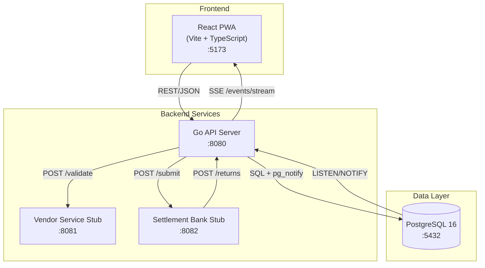
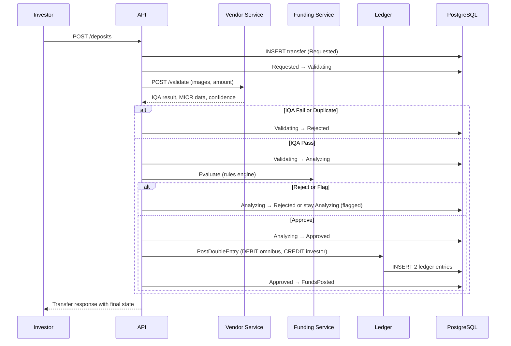
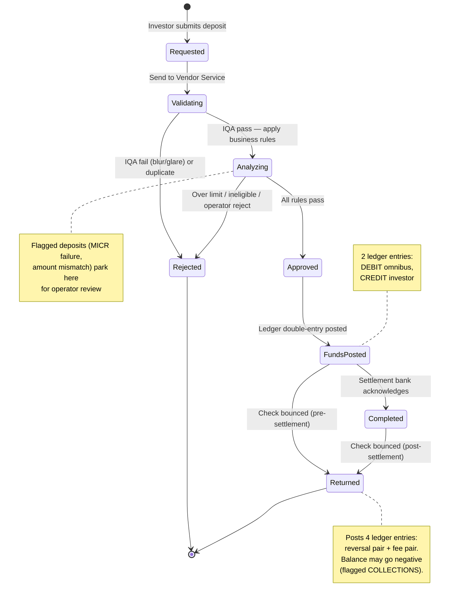
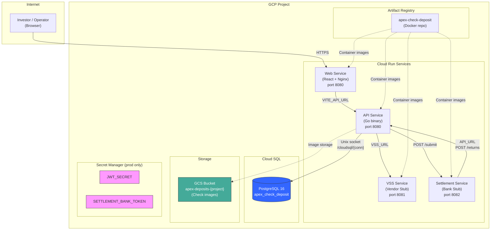
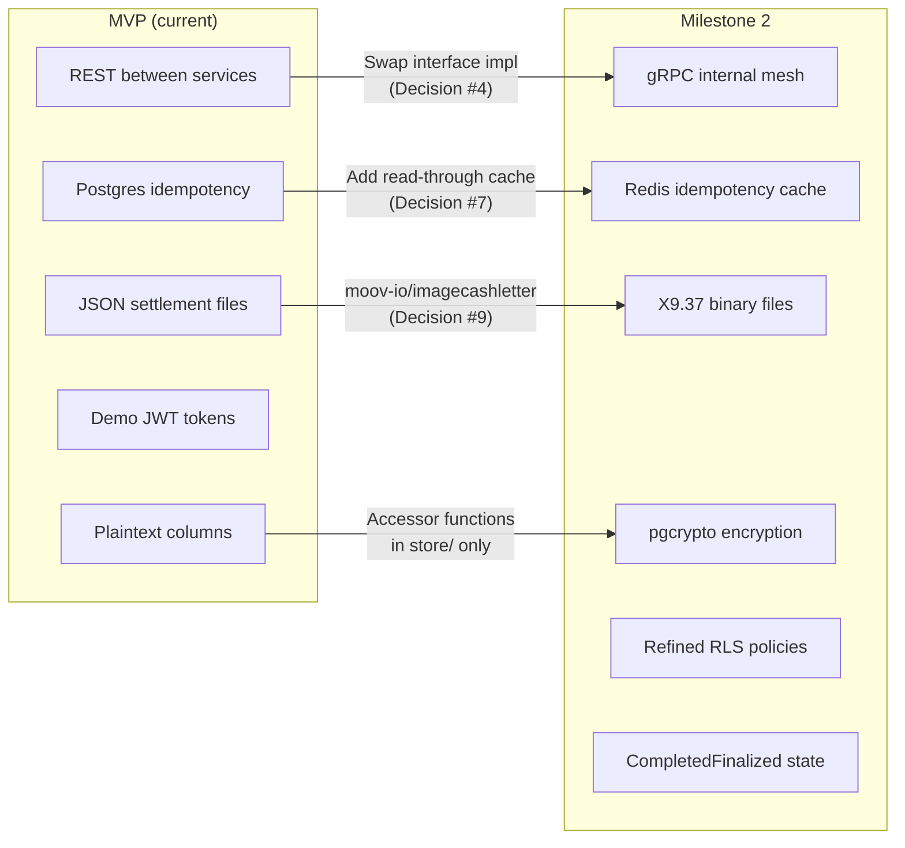

# Architecture

## System Diagram



## Service Boundaries

| Service | Responsibility | Port |
|---------|---------------|------|
| **API Server** (`cmd/api`) | HTTP routing, orchestration, state machine, ledger, settlement engine | 8080 |
| **Vendor Service Stub** (`cmd/vendor-stub`) | Simulates check image validation (IQA, MICR, duplicate detection) | 8081 |
| **Settlement Bank Stub** (`cmd/settlement-stub`) | Simulates settlement file submission and return webhooks | 8082 |
| **PostgreSQL** | Transfers, ledger entries, events, accounts, correspondents, settlement batches | 5432 |
| **React Frontend** (`web/`) | Mobile deposit form, status page, operator queue, ledger dashboard | 5173 |

## Data Flow: Deposit Lifecycle



## Internal Package Structure

```
internal/
├── orchestrator/    # State machine transitions, deposit flow coordination
├── funding/         # Rule engine (5 rules: limit, eligibility, duplicate, MICR, amount)
├── ledger/          # Double-entry bookkeeping (PostDoubleEntry, GetBalance, Reconcile)
├── settlement/      # EOD batch generation, file writing, acknowledgment
├── returns/         # Return processing (reversal + fee posting, COLLECTIONS flagging)
├── store/           # Database access (ONLY package that imports database/sql)
├── events/          # SSE broadcaster via pg_notify listener
├── auth/            # JWT middleware, demo token validation
├── logging/         # Structured logging, PII redaction
├── notify/          # Investor notification creation
└── vendorclient/    # HTTP client for Vendor Service Stub
```

**Architecture boundary:** `internal/store/` is the only package that imports `database/sql`. All other packages use Go interfaces, enabling future gRPC extraction without changing business logic.

## State Machine



8 states, 9 valid transitions. Every transition uses optimistic locking (`UPDATE ... WHERE state = $expected RETURNING id`) and atomically writes an audit event to `transfer_events`. Defined in `internal/orchestrator/states.go`.

## Ledger Invariants

1. Every movement = exactly 2 entries (DEBIT + CREDIT, same `movement_id`)
2. `SUM(credits) - SUM(debits) = 0` always
3. Append-only: never UPDATE or DELETE ledger entries
4. Returns always complete, even if balance goes negative (flag for COLLECTIONS)

---

## GCP Infrastructure (Pulumi)

Infrastructure as Code using Pulumi with Go SDK. Two stacks (dev, prod) with parameterized configuration.

Source: `infra/main.go`, `infra/Pulumi.*.yaml`

### Infrastructure Diagram



### Resource Inventory

| Resource | Type | Dev Config | Prod Config |
|----------|------|-----------|-------------|
| **apex-repo** | Artifact Registry | Docker repo (`DOCKER` format) | Same |
| **apex-postgres** | Cloud SQL (PostgreSQL 16) | `db-f1-micro`, no backups | `db-g1-small`, backups enabled |
| **apex_check_deposit** | Cloud SQL Database | Auto-created | Auto-created |
| **apex** | Cloud SQL User | Password: `apex` | Rotate via Secret Manager |
| **apex-deposits-{project}** | GCS Bucket | Uniform bucket-level access | Same |
| **API** | Cloud Run v2 | min=0, max=10 (scale-to-zero) | min=1, max=10 (always warm) |
| **VSS** | Cloud Run v2 | min=0, max=5 | min=1, max=5 |
| **Settlement** | Cloud Run v2 | min=0, max=5 | min=1, max=5 |
| **Web** | Cloud Run v2 | min=0, max=5 | min=1, max=5 |
| **JWT_SECRET** | Secret Manager | N/A (env var) | Managed secret |
| **SETTLEMENT_BANK_TOKEN** | Secret Manager | N/A (env var) | Managed secret |

### Deployment Order

Cloud Run services are deployed in dependency order:

```
1. VSS Service         (no dependencies)
2. API Service         (needs VSS_URL from step 1)
3. Settlement Service  (needs API_URL from step 2)
4. Web Service         (needs VITE_API_URL from step 2)
```

### Service Connectivity

```
                    ┌─────────────────────────────────────────┐
                    │            Cloud Run Network            │
                    │                                         │
                    │  ┌─────┐  VSS_URL   ┌─────┐           │
                    │  │ API │──────────→  │ VSS │           │
                    │  │     │             └─────┘           │
                    │  │     │  POST /submit                 │
                    │  │     │──────────→  ┌────────────┐    │
                    │  │     │             │ Settlement │    │
                    │  │     │  ←──────── │            │    │
                    │  │     │  POST /returns (webhook) └────┘│
                    │  │     │                                │
                    │  │     │  Unix socket                   │
                    │  │     │──────────→  ┌──────────────┐  │
                    │  │     │             │  Cloud SQL   │  │
                    │  └─────┘             │  /cloudsql/  │  │
                    │     ↑                └──────────────┘  │
                    │     │ VITE_API_URL                      │
                    │  ┌─────┐                                │
                    │  │ Web │                                │
                    │  └─────┘                                │
                    └─────────────────────────────────────────┘
```

### Key Design Decisions

- **Cloud SQL via Unix socket**: No password in connection string needed; Cloud Run mounts `/cloudsql/{connection_name}` automatically
- **Scale-to-zero (dev)**: `minInstances: 0` — services spin down when idle, ~$0 cost
- **Always warm (prod)**: `minInstances: 1` — no cold start latency for first request
- **Secret Manager (prod only)**: JWT_SECRET and SETTLEMENT_BANK_TOKEN stored as managed secrets; dev uses environment variables
- **Startup probe on API**: TCP check on port 8080 with 5s initial delay, 20 retries (up to 200s for DB migration on first deploy)
- **Same language IaC**: Pulumi Go SDK — type-safe infrastructure definitions in the same language as the application

---

## Roadmap: Milestone 2 & 3

The MVP was designed with explicit seams for future extraction. Each upgrade path is documented in `decision_log.md` with the decision that created the seam.

### Milestone 2 — Hardening + Infra Signals



| Item | MVP Seam | Code Location |
|------|----------|---------------|
| **gRPC extraction** | `FundingServiceClient`, `LedgerService`, `VendorServiceClient` interfaces | `internal/funding/interface.go`, `internal/ledger/interface.go`, `internal/vendorclient/interface.go` |
| **Redis idempotency** | Same `Idempotency-Key` contract; Postgres table stays as fallback | `cmd/api/middleware/idempotency.go` |
| **X9 binary files** | `SettlementFile` struct already mirrors X9 concepts (FileHeader, CashLetter, Bundles) | `internal/settlement/engine.go:44-84` |
| **pgcrypto hooks** | `internal/store/` is the only `database/sql` importer — encryption accessor functions go here | `internal/store/*.go` |
| **RLS refinement** | Initial policies scaffolded | `db/migrations/009_rls_policies.sql` |
| **CompletedFinalized** | One new state + one transition added to immutable table | `internal/orchestrator/states.go` |

### Milestone 3 — Differentiation

| Item | What It Adds | Builds On |
|------|-------------|-----------|
| **Risk dashboard** (`/admin/risk`) | Float exposure by correspondent, return rates, top investors by outstanding provisional credit | Ledger queries + `transfer_events` aggregation |
| **GCP Identity Platform** | Real auth — Firebase JWT custom claims via same `middleware.Auth()` interface | `cmd/api/middleware/auth.go` (Decision #8) |
| **Decision trace search** | Cross-transfer search on `transfer_events` with admin tab | `GET /deposits/{id}/events` already exists; add cross-transfer query |
| **QA/staging Pulumi stack** | Third environment for pre-prod validation | `infra/Pulumi.qa.yaml` (same parameterized pattern as dev/prod) |

Full details: `docs/prd.md` sections 12.2–12.3. Architectural seams documented in `docs/decision_log.md` decisions #4, #7, #8, #9.
