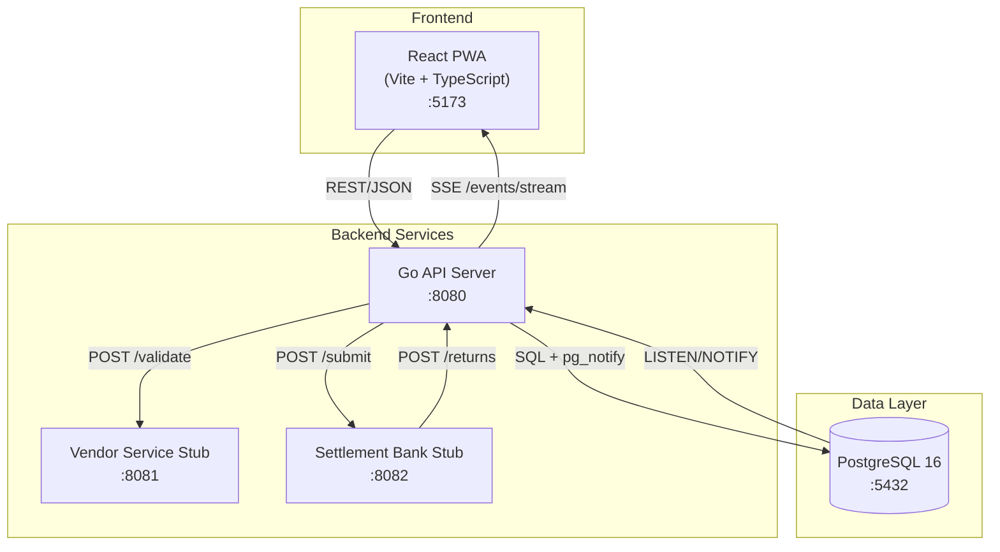
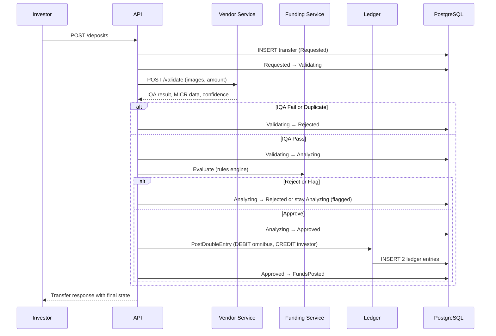

# Architecture

## System Diagram



## Service Boundaries

| Service | Responsibility | Port |
|---------|---------------|------|
| **API Server** (`cmd/api`) | HTTP routing, orchestration, state machine, ledger, settlement engine | 8080 |
| **Vendor Service Stub** (`cmd/vendor-stub`) | Simulates check image validation (IQA, MICR, duplicate detection) | 8081 |
| **Settlement Bank Stub** (`cmd/settlement-stub`) | Simulates settlement file submission and return webhooks | 8082 |
| **PostgreSQL** | Transfers, ledger entries, events, accounts, correspondents, settlement batches | 5432 |
| **React Frontend** (`web/`) | Mobile deposit form, status page, operator queue, ledger dashboard | 5173 |

## Data Flow: Deposit Lifecycle



## Internal Package Structure

```
internal/
├── orchestrator/    # State machine transitions, deposit flow coordination
├── funding/         # Rule engine (5 rules: limit, eligibility, duplicate, MICR, amount)
├── ledger/          # Double-entry bookkeeping (PostDoubleEntry, GetBalance, Reconcile)
├── settlement/      # EOD batch generation, file writing, acknowledgment
├── returns/         # Return processing (reversal + fee posting, COLLECTIONS flagging)
├── store/           # Database access (ONLY package that imports database/sql)
├── events/          # SSE broadcaster via pg_notify listener
├── auth/            # JWT middleware, demo token validation
├── logging/         # Structured logging, PII redaction
├── notify/          # Investor notification creation
└── vendorclient/    # HTTP client for Vendor Service Stub
```

**Architecture boundary:** `internal/store/` is the only package that imports `database/sql`. All other packages use Go interfaces, enabling future gRPC extraction without changing business logic.

## State Machine

```
Requested → Validating → Analyzing → Approved → FundsPosted → Completed → Returned
                 ↓            ↓                       ↓
              Rejected    Rejected                  Returned
```

8 states, 7 valid transitions. Every transition uses optimistic locking and writes an audit event.

## Ledger Invariants

1. Every movement = exactly 2 entries (DEBIT + CREDIT, same `movement_id`)
2. `SUM(credits) - SUM(debits) = 0` always
3. Append-only: never UPDATE or DELETE ledger entries
4. Returns always complete, even if balance goes negative (flag for COLLECTIONS)
